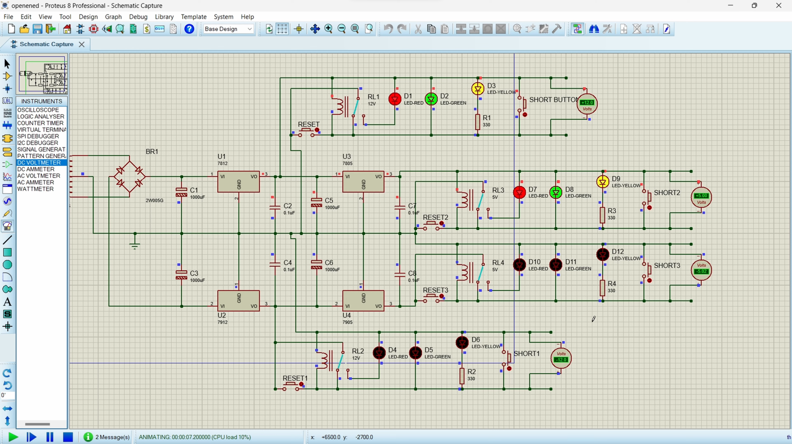
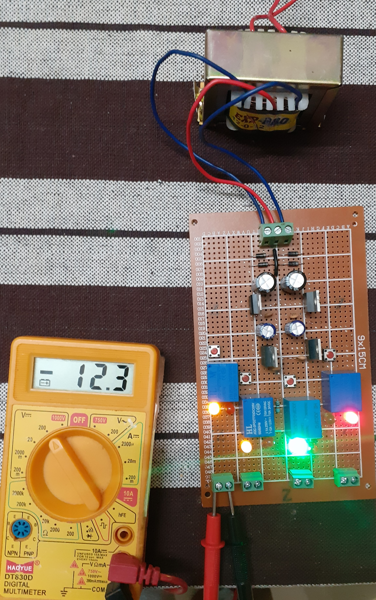
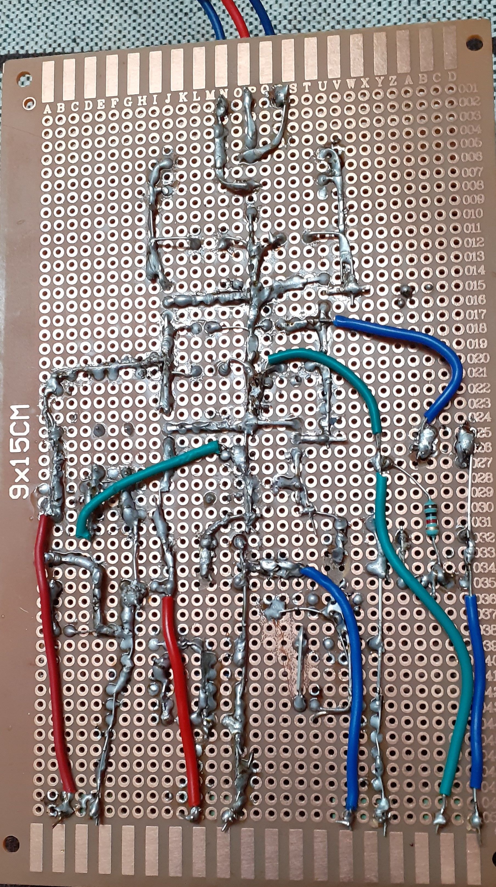

# Multi-Voltage Power Supply with Short-Circuit Protection

## Course Name
 **Analog Electronics**

## Problem Statement
Design and implement a multi-voltage power supply providing outputs of **+5V, -5V, +12V, -12V** with built-in short-circuit protection.

## Abstract
This project focuses on designing a robust and reliable power supply circuit capable of delivering **+5V, -5V, +12V, and -12V** outputs with short-circuit protection for each voltage rail. The design was implemented and tested using Proteus simulation software, and the physical circuit was assembled on a zero PCB for validation.

The circuit ensures stable and protected voltage outputs for various applications, using a combination of diodes, relays, capacitors, and voltage regulators. **Short-circuit protection** prevents damage to components, making it safe for use in sensitive electronic projects.

## Features
- Voltage Outputs: Provides four voltage rails: +5V, -5V, +12V, -12V.
- Short-Circuit Protection: Prevents component damage under fault conditions.
- Modular Design: Easy to assemble and test on a zero PCB.
- Compact Implementation: Designed for efficient use of space and resources.

## Components Used
|             Component            |      Specification     |  Quantity |
|:--------------------------------:|:----------------------:|:---------:|
| Diodes                           | IN4007                 | 4         |
| Voltage Regulators               | 7805, 7812, 7905, 7912 | 1 each    |
| Relays                           | 5V and 12V             | 2 each    |
| Capacitors                       | 0.1uF, 100uF, 1000uF   | 4, 2, 2   |
| Transformer                      | 12-0V                  | 1         |
| 2-Pin Fixed Screw Terminal Block | -                      | 4         |
| 3-Pin Fixed Screw Terminal Block | -                      | 1         |
| Zero PCB                         | -                      | 1         |
| LEDS                             | green,red              | 4, 4      |
| Push button                      | -                      | 4         |
| Wires                            | -                      | As needed |

## Methodology
### 1. Circuit Design
- Simulation: The circuit was designed and simulated using Proteus software to verify functionality.
- Implementation: The physical circuit was built on a zero PCB, ensuring compact and sturdy connections.
### 2. Components and Configuration
- Bridge Rectifier: Four IN4007 diodes configured to convert AC to DC.
- Voltage Regulators: 7805 and 7812 for positive voltage rails, 7905 and 7912 for negative voltage rails.
- Capacitors: Used for smoothing and filtering the rectified voltage.
- Relays: Provide short-circuit protection by disconnecting the load during fault conditions.
- Transformer: Steps down the input AC voltage to 12-0V AC for the circuit.

### 3. Testing
- Simulation: Verified the voltage outputs and short-circuit protection in Proteus software.
- Physical Validation: The circuit was tested on a zero PCB, with results matching the expected outputs.
## Circuit Diagram

### Implementation Snapshots :

## Results
### 1. Voltage Outputs:

- +5V: Stable and regulated.
- -5V: Stable and regulated.
- +12V: Stable and regulated.
- -12V: Stable and regulated.
### 2. Short-Circuit Protection:

- Tested under simulated fault conditions.
- Relays successfully disconnected the load, preventing component damage.

## Video Demonstration
Watch the [**YouTube video**](https://youtu.be/H-fEH-eCBRA?si=L9QfG5TE6YpF3GQp) showcasing the circuit simulation .
## Conclusion
This project successfully demonstrates the design and implementation of a multi-voltage power supply with short-circuit protection. The combination of simulation and practical assembly ensures reliability and ease of replication. It serves as a versatile tool for powering various analog and digital circuits.